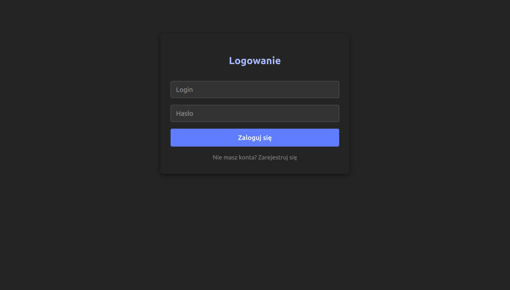
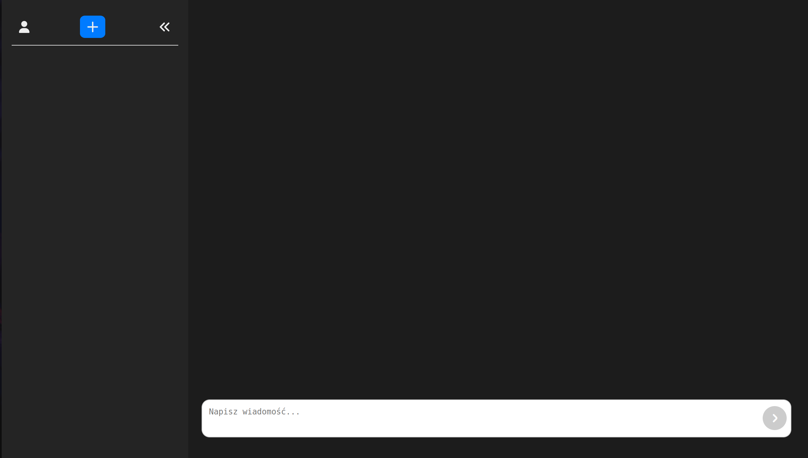
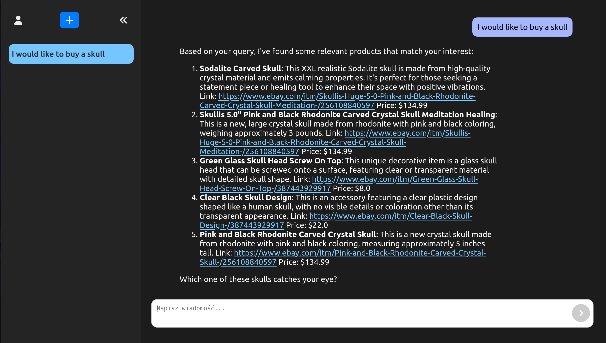
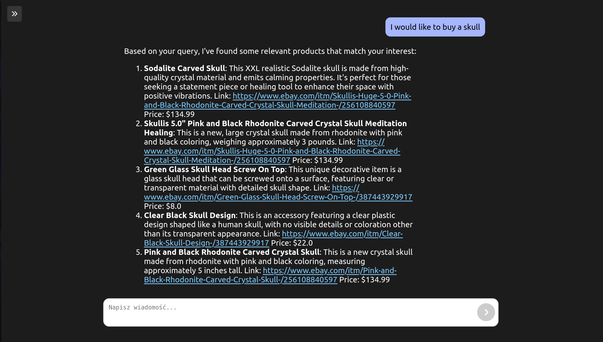
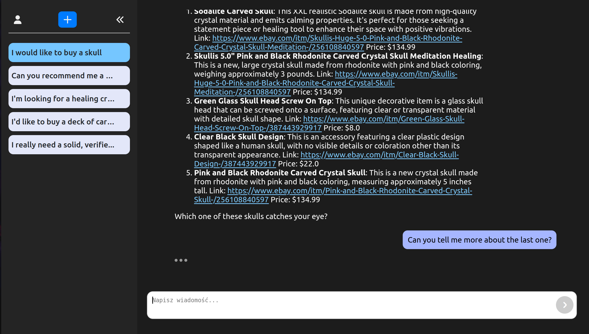

# AI Chatbot for e-Commerce

A web application that allows users to interact with an AI assistant tailored for online stores. Built with React on the frontend and FastAPI on the backend, it supports text and voice input, stores conversation history in Firebase Firestore, and renders AI responses with Markdown.

## Key Features

- **User Authentication**  
  Email/password sign-up and sign-in via Firebase Authentication.

- **Chat with AI**  
  Start new conversations or continue past ones.

- **Voice Input**  
  Record your message via the browser’s Web Speech API (if supported).

- **Persistent History**  
  Browse and delete past chats. History is stored in Firestore and sorted by creation date.

- **Responsive & Dark-Mode UI**  
  Styled with Styled Components for a clean, minimalist dark theme.

--- 

## Tech Stack

- **Frontend**: React, Styled Components, react-markdown, react-speech-recognition  
- **Backend**: FastAPI (Python) with a retrieval-augmented Llama-based chatbot  
- **Database**: Firebase Firestore (NoSQL)  
- **Authentication**: Firebase Auth (Email/Password)

---

## Installation

### 1. Clone the repo

```bash
git clone https://github.com/orrienn/ecommerce-app.git
cd ecommerce-app
```

### 2. Install dependencies

```bash
cd src
npm install
```

## Configuration

Create a ```.env``` file in ```src``` folder, containing:
```
VITE_FIREBASE_API_KEY = YOUR_KEY
```
where ```YOUR_KEY``` should be replaced with your own Firebase API key

## Running Locally

```bash
cd src
npm run dev
# Open http://localhost:5173
```

## Gallery

<figure style="text-align: center; font-style: italic;">
  
  <figcaption>Login screen</figcaption>
</figure>

<figure style="text-align: center; font-style: italic;">
  
  <figcaption>Main app view</figcaption>
</figure>

<figure style="text-align: center; font-style: italic;">
  
  <figcaption>Assistant's response</figcaption>
</figure>

<figure style="text-align: center; font-style: italic;">
  
  <figcaption>Compact view</figcaption>
</figure>

<figure style="text-align: center; font-style: italic;">
  
  <figcaption>Chat history accessible on the sidebar</figcaption>
</figure>